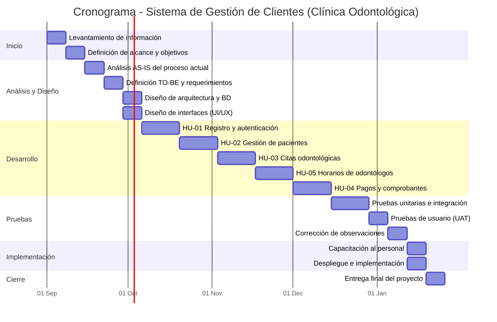

# Sistema de Gestión de Citas de Clientes — Clínica Odontológica

Análisis de negocio, matriz de requerimientos y cronograma del proyecto, basados en las historias de usuario (HU) definidas por el equipo.

## Tabla de contenidos

- [0. Historias de Usuario de Referencia](#0-historias-de-usuario-de-referencia)
- [1. Análisis de Negocio (AS-IS / TO-BE)](#1-análisis-de-negocio-as-is--to-be)
- [2. Matriz de Requerimientos Funcionales y No Funcionales](#2-matriz-de-requerimientos-funcionales-y-no-funcionales)
- [3. Cronograma del Proyecto (Gantt)](#3-cronograma-del-proyecto-gantt)

---

## 0. Historias de Usuario de Referencia

| Código | Título de la Historia de Usuario | Responsable Asignado | Estado Inicial |
|---|---|---|---|
| HU-01 | Registro y autenticación de usuarios | Jeffry Steve López Merino | To Do |
| HU-02 | Gestión de pacientes y datos personales | Diego Alfredo Chuchon Córdova | To Do |
| HU-03 | Gestión de citas odontológicas y horarios disponibles | Julio Jean Pierre Guerra Yllanez | To Do |
| HU-04 | Gestión de pagos y registro de comprobantes | Flavio Falconi Fernández | To Do |
| HU-05 | Gestión de horarios y disponibilidad de odontólogos | Jomar Gabriel Hernández Cervantes | To Do |

---

## 1. Análisis de Negocio (AS-IS / TO-BE)

### 1.1 Introducción

El presente análisis identifica la situación actual (AS-IS) de los procesos de atención al paciente en la clínica odontológica, y propone la situación futura deseada (TO-BE) tras la implementación del sistema de gestión de clientes.

### 1.2 Situación Actual (AS-IS)

Actualmente, la clínica gestiona la información de sus pacientes de forma manual o mediante herramientas ofimáticas no integradas (Excel, agendas físicas, historias clínicas en papel). Esto genera:

- Duplicidad y pérdida de información de pacientes.
- Cruces de horario en el agendamiento de citas.
- Dificultad para acceder al historial clínico completo de un paciente.
- Ausencia de reportes consolidados para la toma de decisiones.
- Alto índice de inasistencias por falta de recordatorios automáticos.

### 1.3 Situación Futura (TO-BE)

Con la implementación del sistema de gestión de clientes, la clínica contará con una plataforma centralizada que integra el registro de pacientes, agendamiento, historial clínico, pagos y disponibilidad de odontólogos, permitiendo una atención más ágil, trazable y orientada a datos.

### 1.4 Comparativo AS-IS vs TO-BE

| Proceso (HU) | AS-IS (Situación Actual) | TO-BE (Situación Propuesta) |
|---|---|---|
| **Registro y autenticación de usuarios** (HU-01) | No existe un control formal de acceso; cualquier miembro del personal usa credenciales compartidas o registros en papel, sin diferenciación de roles. | Registro y autenticación con usuario y contraseña individuales, con roles diferenciados (administrador, recepción, odontólogo, paciente). |
| **Gestión de pacientes y datos personales** (HU-02) | Los datos del paciente se anotan en fichas físicas o Excel independientes por consultorio, con información duplicada y desactualizada. | Registro digital centralizado de pacientes en una base de datos única, con validación de datos y búsqueda instantánea por DNI/nombre. |
| **Gestión de citas odontológicas y horarios disponibles** (HU-03) | Las citas se coordinan por teléfono o WhatsApp y se anotan en una agenda física, generando cruces de horario e inasistencias no controladas. | Módulo de citas en línea que muestra los horarios disponibles por odontólogo, bloquea automáticamente los horarios ocupados y confirma la cita al paciente. |
| **Gestión de pagos y registro de comprobantes** (HU-04) | Los cobros se registran en cuadernos o Excel separado del historial de atención, sin trazabilidad entre la atención y el pago. | Registro de pagos integrado a la atención odontológica, con generación automática de comprobantes y consulta del historial de pagos del paciente. |
| **Gestión de horarios y disponibilidad de odontólogos** (HU-05) | La disponibilidad de cada odontólogo (turnos, descansos, licencias) se coordina de manera verbal entre el personal administrativo. | Configuración digital de horarios de atención por odontólogo, con bloqueo de horarios no disponibles (vacaciones, licencias) visible en el módulo de citas. |

---

## 2. Matriz de Requerimientos Funcionales y No Funcionales

### 2.1 Requerimientos Funcionales (RF)

Cada RF se vincula a la historia de usuario (HU) de la que se deriva.

| ID | Nombre | Descripción | Prioridad | HU |
|---|---|---|---|---|
| RF-01 | Registro de usuario | El sistema debe permitir registrar nuevos usuarios (paciente, odontólogo, personal administrativo) con datos básicos y rol asignado. | Alta | HU-01 |
| RF-02 | Autenticación de usuario | El sistema debe permitir iniciar sesión mediante usuario/correo y contraseña, validando las credenciales ingresadas. | Alta | HU-01 |
| RF-03 | Recuperación de contraseña | El sistema debe permitir restablecer la contraseña de un usuario mediante verificación por correo electrónico. | Media | HU-01 |
| RF-04 | Registro de datos del paciente | El sistema debe permitir registrar y editar los datos personales y de contacto de un paciente. | Alta | HU-02 |
| RF-05 | Búsqueda de pacientes | El sistema debe permitir buscar pacientes por nombre, número de documento o código de historia clínica. | Alta | HU-02 |
| RF-06 | Historial clínico del paciente | El sistema debe registrar el historial de atenciones odontológicas asociado a cada paciente. | Alta | HU-02 |
| RF-07 | Agendamiento de citas | El sistema debe permitir crear una cita odontológica seleccionando paciente, odontólogo, fecha y hora disponible. | Alta | HU-03 |
| RF-08 | Consulta de horarios disponibles | El sistema debe mostrar los horarios disponibles de cada odontólogo antes de confirmar una cita. | Alta | HU-03 |
| RF-09 | Reprogramación y cancelación de citas | El sistema debe permitir reprogramar o cancelar una cita ya registrada, liberando el horario correspondiente. | Media | HU-03 |
| RF-10 | Registro de pagos | El sistema debe permitir registrar el pago asociado a una atención odontológica, indicando el monto y método de pago. | Alta | HU-04 |
| RF-11 | Generación de comprobantes | El sistema debe generar un comprobante de pago (boleta/recibo) por cada transacción registrada. | Alta | HU-04 |
| RF-12 | Historial de pagos del paciente | El sistema debe mostrar el historial de pagos y saldos pendientes de cada paciente. | Media | HU-04 |
| RF-13 | Configuración de horarios del odontólogo | El sistema debe permitir a cada odontólogo o al administrador configurar los horarios de atención disponibles. | Alta | HU-05 |
| RF-14 | Gestión de disponibilidad | El sistema debe permitir bloquear fechas u horarios no disponibles (licencias, vacaciones, descansos) por odontólogo. | Media | HU-05 |

### 2.2 Requerimientos No Funcionales (RNF)

| ID | Categoría | Descripción | Prioridad |
|---|---|---|---|
| RNF-01 | Seguridad | El sistema debe almacenar las contraseñas cifradas y proteger los datos personales y clínicos del paciente conforme a la normativa de protección de datos vigente. | Alta |
| RNF-02 | Disponibilidad | El sistema debe estar disponible al menos el 99% del tiempo durante el horario de atención de la clínica. | Alta |
| RNF-03 | Usabilidad | La interfaz debe permitir que el personal administrativo registre una cita en no más de 3 pasos, sin necesidad de capacitación técnica avanzada. | Alta |
| RNF-04 | Rendimiento | El sistema debe responder a las búsquedas de pacientes, citas y horarios en menos de 2 segundos bajo uso normal. | Media |
| RNF-05 | Escalabilidad | El sistema debe soportar el incremento del número de pacientes, odontólogos y citas sin degradar su rendimiento. | Media |
| RNF-06 | Compatibilidad | El sistema debe ser accesible desde navegadores web modernos (Chrome, Edge, Firefox) y adaptarse a dispositivos móviles. | Media |
| RNF-07 | Respaldo y recuperación | El sistema debe realizar copias de seguridad automáticas y periódicas de la base de datos. | Alta |
| RNF-08 | Auditoría | El sistema debe registrar un log de acciones críticas: creación, edición o eliminación de citas, pagos e historiales clínicos. | Media |
| RNF-09 | Mantenibilidad | El sistema debe estar documentado y estructurado de forma modular, permitiendo incorporar nuevas funcionalidades sin reescribir el sistema completo. | Baja |

---

## 3. Cronograma del Proyecto (Gantt)

El proyecto se planifica en 6 fases a lo largo de 17 semanas (aproximadamente 4 meses).

### 3.1 Fases del Proyecto

| Fase | Nombre | Actividades principales | Período | Duración |
|---|---|---|---|---|
| 1 | Inicio y Planificación | Levantamiento de información, definición de alcance y objetivos | Semana 1 - 2 | 2 semanas |
| 2 | Análisis y Diseño | Análisis AS-IS/TO-BE, definición de requerimientos, diseño de arquitectura y UI/UX | Semana 3 - 5 | 3 semanas |
| 3 | Desarrollo | Construcción de HU-01 a HU-05: autenticación, pacientes, citas, horarios de odontólogos y pagos | Semana 6 - 11 | 6 semanas |
| 4 | Pruebas | Pruebas unitarias, de integración, pruebas de usuario (UAT) y corrección de observaciones | Semana 12 - 14 | 3 semanas |
| 5 | Implementación | Capacitación al personal y despliegue en producción | Semana 15 - 16 | 2 semanas |
| 6 | Cierre | Entrega final y cierre formal del proyecto | Semana 17 | 1 semana |

### 3.2 Diagrama de Gantt

> GitHub renderiza este bloque Mermaid automáticamente al ver el archivo en el repositorio.

---

*Documento generado a partir de las historias de usuario del proyecto — Sistema de Gestión de Clientes para Clínica Odontológica.*
